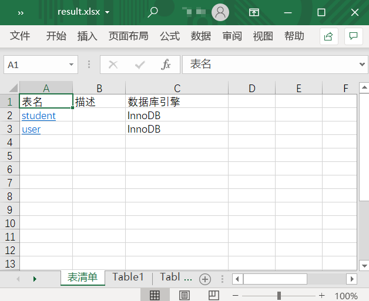
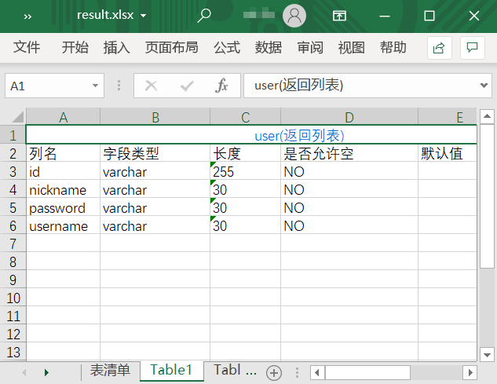

# my-excel-exporter
## 功能说明

- 可将表结构输出到excel中，便于查看和作为文档存放
- 表清单sheet名称可在config中自定义
- 提供超链接在清单页和单个表结构页间跳转
- 可自定义查询字段和表格中搞得列名，程序会读取conf目录下的sql文件进行查询，列名取AS后的别名（实现是解析第一个select和第一个from之前的字段）
## 使用说明
1. 在conf下拷贝一份config.json.sample，命名为config.json
2. 根据需求修改配置项
3. 如果是下载源码，需编译后运行；如果下载的是release中的zip，运行其中的exe文件即可
## 配置说明
|配置项名称|含义|sample中的默认值|
 |----|----|----|
 |driver|数据库驱动|mysql|
 |username|用户名|root|
 |password|密码||
 |host|主机地址|localhost|
 |port|端口|3306|
 |schema|数据库名|test|
 |listSheetName|表清单sheet的名字|表清单|
 |excelPath|保存excel的位置|./result.xlsx|
 |tableColName|表清单sheet中表名所在列的列名|表名|
 |style|样式|[见sample](./conf/config.json.sample)|
##### 关于style配置
目前仅支持sample中的两项配置，hyperLinkStyle对应列表页的表名超链接style，hyperLinkTitleStyle对应表结构页的标题超链接style。可参考excelize官方文档进行修改（链接见下方）
## 参考资料
- **excelize官方文档** https://xuri.me/excelize/zh-hans/
- **go-sql-driver** https://github.com/go-sql-driver/mysq